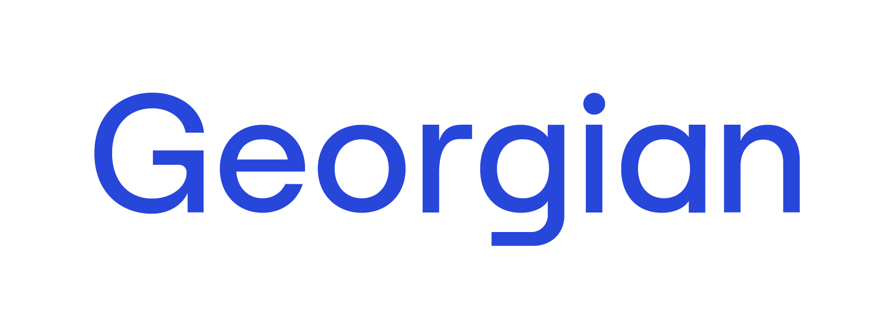

# Georgian GenAI Boot Camp

Welcome to the Georgian GenAI boot camp repository. This repository contains all the demos we used during our bootcamps. Content for the latest bootamp can be found under the [notebooks](https://github.com/georgian-io/genai-bootcamp/tree/main/notebooks) directory. A copy of the content from previous bootcamps can be found in the [archive](https://github.com/georgian-io/genai-bootcamp/tree/main/archive).

## Table of Contents

* [Goals](#goals)
* [Agenda](#agenda)
* [API Access](#api-access)
* [Setup & Installation](#setup--installation)
* [Repository Info](#repository-info)
* [Resources](#resources)

---
## Goals
Our bootcamps usually consist of a few days of tutorials followed by a hackathon. At the end of the hackathon our goal was for participants to have:
- A deeper understanding of the opportunities GenAI unlocks.
- A theoretical understanding of the latest GenAI technologies.
- A practical understanding of the latest GenAI technologies.
- Implemented at least one end-to-end application using GenAI.

[[Back to top]](#)

---
## Agenda

Below you can see the agenda we followed for our boot camp in October 2023. 

### Day 1: 

#### Introduction to LLMs & Prompt Engineering (Georgian & Vector Institute)
* Introduction to LLMs - David Emerson (Vector Institute)
* Prompt Engineering Basics - Akash Saravanan (Georgian)

#### Prompt Engineering (Georgian)
* Chain-of-Thought & Reasoning - Akash Saravanan (Georgian)
* Retrieval Augmented Generation (RAG) - Akash Saravanan (Georgian)
* Advanced Prompting Techniques - Pashootan Vaezipoor (Georgian)
* Prompt Evaluation - Pashootan Vaezipoor (Georgian)

#### Demo Session 
* TBD

### Day 2:
#### Fine-Tuning & Alignment (Georgian)
* Fine-Tuning, PeFT, & LoRA - Rohit Saha (Georgian)
* Alignment & RLHF - Akash Saravanan (Georgian)

#### Tools, Platforms, & Deployment (Georgian)
* Tools & Libraries (LangChain, PandasAI) - Rodrigo Ceballos (Georgian)
* Agents - Rodrigo Ceballos (Georgian)
* Interfaces - Rodrigo Ceballos (Georgian)
* Vector Databases & RAG - Kyryl Truskovskyi (Georgian)
* Orchestration - Kyryl Truskovskyi (Georgian)
* Deployment - Kyryl Truskovskyi (Georgian)

#### Privacy, Trust & Responsible AI (Georgian)
* Privacy, Trust & Responsible AI - Angeline Yasodhara (Georgian)
* Synthetic Data for Evaluation - Rodrigo Ceballos (Georgian)

### Day 3-5:

#### Demo Sessions
TBD

[[Back to top]](#)

---
## API Access

### Bootcamp Participants:

To be able to run the notebooks here, you'll need access to API keys for all the different services. Fear not! We've provided you with all the API keys you need! Just download the files we've sent to you and place them in the root of this directory.

### Non-Bootcamp Participants:

To be able to run the notebooks here, you'll need access to API keys for all these services. Read on for instructions on how to set up each of the APIs that you need. Many of these APIs (such as OpenAI) will charge you based on usage, so you will need to set up billing.

Note that to run the examples, you only need to have one LLM setup. So if you already have access to an OpenAI key, you could run all the notebooks with it (excluding the Google/HuggingFace examples). The PrivateAI API key is used only for the PrivateAI demo (`notebooks/extra_resources/PrivateAI Demo.ipynb`). We use AnyScale to set up LLaMa 2 access. 

1. Create a `.env` file. In the root directory of this repo (I.E., the same directory this readme is in), create a `.env` file. Ensure that the period is present at the start of the filename. Within this file, place the following text:
```
OPENAI_API_KEY=""
GOOGLE_APPLICATION_CREDENTIALS="../../google-api.json"
PRIVATE_AI_API_KEY = ""
ANYSCALE_API_KEY = ""
```

1. OpenAI: Create an OpenAI account (or login) and visit the [API Keys](https://platform.openai.com/account/api-keys) page. Generate an API key here and place it in the `.env` file you created above. These examples were designed with GPT-4. If you do not have access to it, please request access through the [waitlist](https://openai.com/waitlist/gpt-4-api). Or alternatively, you can use `gpt-3.5-turbo` instead.
2. Google: Follow steps 1 through 4 detailed in this [link](https://cloud.google.com/vertex-ai/docs/start/client-libraries). Once you have downloaded the service account key from step 4, place it in the root directory of this repository and rename it to `google-api.json`. 
3. PrivateAI: Request an API key through [this form](https://www.private-ai.com/api-key/). Add it to the `.env` file above.
4. AnyScale: Once you have billing setup, you can get your API keys from the [credentials](https://app.endpoints.anyscale.com/credentials) page.
5. You should now have all fields in the `.env` file setup and ready to go! You can now proceed with the installation steps below.

[[Back to top]](#)

---
## Setup & Installation

0. This repository requires you to have installed poetry as a dependency manager. Please follow the instructions to install poetry from [here](https://python-poetry.org/docs/#installation). 

1. Environment management options
   
    a)  Poetry: ```poetry shell```
    
    b) Conda: create and activate a conda env for this project:
```bash
conda create -n genai-bootcamp python=3.10
conda activate genai-bootcamp
```

2. Install package
```
poetry install
```

3. Check installation worked by running 
```
pytest .
```

4. Setup private environment files

Paste the `.env` file and `google-api.json` file provided to you into root directory of this repository.

Note: DO NOT COMMIT THIS FILE OR SHARE IT ANYWHERE!

Note: If you have trouble setting up Poetry, you should be able to skip it and just run `pip install -r requirements.txt` instead. Please reach out to us or create an issue if this does not work.

[[Back to top]](#)

## Repository Info
### Poetry
We use [poetry](https://python-poetry.org/) as our dependency manager.
The link above has great documentation but there is a TL;DR.

- Install the package: `poetry install`
- Add a dependency: `poetry add <python-lib>`
- Where are dependencies specified? `pyproject.toml` include the high level requirements. The latests exact versions installed are in `poetry.lock`.

### Debugging
- If for some reason `poetry install` fails to install a library try to `pip install <lib>` and then run `poetry install` again. This solves 95% of these errors.

[[Back to top]](#)

## Resources

* [GenAI Interface Cookiecutter](https://github.com/rodrigo-georgian/genai-interface-cookiecutter): A cookie cutter template for you to start off with a basic UI using streamlit.
* [Georgian AI Library (GAL)](https://github.com/georgian-io/GAL): Our library containing overviews of AI techniques.

[[Back to top]](#)